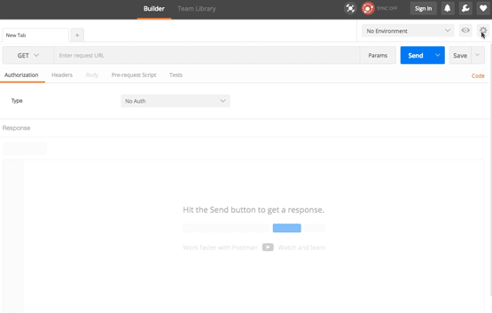

# Movied Angular

Time to create your first app using Angular, a component-based framework to create single-page applications. The minimum required feature set includes showing a list of the trending movies, and accessing a movie detail page.

Your finished app should look more or less like this:

## What to expect

In addition to learning the Angular framework, you are required to get familiar with a handful of new and exciting libraries and tools such as: ESNext, Angular-CLI, Typescript, and Observables with RxJS.

Keep in mind that your objective for now is to figure out how to build something, not become an Angular expert. You will have time to grow your expertise once you understand the basic building blocks. 

This is your chance to experiment and see if you can get it up and running with minimal guidance. Don’t hesitate to ask for help if you are stuck for too long!

## Learning objectives

While you are going through the exercise, keep in mind the following learning objectives. If by the end you don’t feel you have accomplished these objectives, please reach out to an instructor or TA.

1. Understand how to use the [3 building blocks of Angular](https://angular.io/guide/architecture):
    - Modules
    - Components (with templates, directives, and data binding)
    - Services and dependency injection
2. Be capable of pointing out the core differences between Angular and other front-end frameworks (as you learn them).
3. Feel comfortable diving into a suite of unfamiliar tools / libraries, and become confident that you can figure out how to get started building something.
4. Familiarize yourself with some thought leaders in the Angular community.
5. Be able to work with `angular-cli` to guide you through the creation and maintenance of an Angular project.
6. Understand the Observable pattern and how to apply it using [RxJS](https://rxjs-dev.firebaseapp.com/). 

## Getting started

1. **Install and read the docs for [Angular CLI](https://github.com/angular/angular-cli/wiki)**. We have used Angular CLI to create the seed repo for this app, you can use it to create your components, services and whatever you need. Install it and read its documentation so you get familiar with it.
2. **Install [Postman](https://www.getpostman.com/)** and check how it works.
3. **Review the design specs** in `movied-design.pdf`
4. **Take a glance at the [Angular style guide](https://angular.io/styleguide)**, and use it as a reference throughout your project.

## API & Postman Notes

To simulate a real-world project, we provide you with an API at `http://cw-api.eu-west-3.elasticbeanstalk.com/movied`.

Follow these animated gifs to setup Postman. This will give you all the methods allowed by the API so that you can explore its capabilities.

**Note**: The API only returns the end of the image url, you can access that image by prepending `https://image.tmdb.org/t/p/w300/` to it.

### Setup in 3 simple steps:

1. Add the `movied-postman-collection.json` to Postman. You will see the left side bar fill with 9 requests if one successfully.

2. Create the `Movied` environment and add `url` as an environment variable to it. After you’re done make sure you set the `Movied` environment as your current environment.

3. Make a few sample requests to the Movied API to see how it works.

## Tasks

Follow best practices such as commenting your code, committing often and being mindful of indentation. When creating a new project with Angular CLI, a linter is automatically set up for you. Make sure to lint your code before committing, as this will help your work look professional.

1. Run `ng new movied --directory client` to set up a new Angular app in the `./client` folder using the Angular CLI.
2. Create a Movie class/interface. This will represent a movie object in our app.
3. Create a service named `ApiClient` (find the correct command to use in the CLI). This service exposes some methods that make the HTTP requests to the movied server  . Develop the following methods:
    - `getDiscoverMovies()` – Get the box-office list of movies
    - `getCategoryMovies(categoryId)` – Get the list of movies for a given category
4. On the `/` endpoint (i.e. home), show a `Dashboard` component. This component will show the list of movies in the box-office (discover endpoint). This list should be presented in an horizontal fashion. When scrolling horizontally, the title should remain static. The idea here is to create the components `MovieList` and `MovieListItem` that will be reused.
5. Add a second list below the first one that displays the movies you get when requesting the `action` category. Reuse the components you created on task 4.
6. When clicking on a movie, the browser should go into a `/:movieId` path, rendering a component that shows the details for that movie.
7. Add a couple of unit tests for your app.

## Extra credits

1. Instead of the `action` category, render a selector that lets the user select from a list of categories. When selecting a category, reload the list of movies. Add the appropriate method in the `ApiClient`.
2. Implement a search feature. Show an input in the navigation bar that lets you search for different movies, and performs requests to the api as you type (throttled). Show the results on top of the app (overlayed).
3. Implement the rating feature for the movie detail page.
